<h1 align="center">⚡ Sowmiya – AI/ML Engineer</h1>

---

<!-- Wavy Banner -->

 

<!-- Badge Row 1 -->

  <!-- University -->
  

  <!-- Focus -->
  

  <!-- Learning -->
  

  <!-- Interest -->
  

<!-- Badge Row 2 -->

  

---

## 👩‍💻 About Me  

I'm an **AI/ML Engineer** passionate about building intelligent systems that solve real-world problems using Artificial Intelligence, Machine Learning, Deep Learning, and Computer Vision.

Currently, I'm working on AI-powered applications, healthcare prediction systems, intelligent automation, and geospatial visualization. I enjoy transforming research ideas into production-ready solutions with scalable architectures.

## 💼 Professional Experience

### AI/ML Engineer
**ENARXI Innovation Pvt. Ltd.** | *2026 – Present*

- Developing AI-powered applications and intelligent automation solutions.
- Building scalable backend services using FastAPI and Python.
- Designing and integrating Machine Learning and Deep Learning models.
- Working with Computer Vision, Large Language Models (LLMs), and Retrieval-Augmented Generation (RAG).
- Collaborating in Agile teams to deliver production-ready software.

## 🛠 Tech Stack

<table>

<tr>
<td width="250" valign="middle">

👨‍💻 Languages

</td>

<td valign="middle">

 <b>Python</b>    <b>Java</b>    <b>JavaScript</b>    <b>HTML5</b>    <b>CSS3</b>    <b>SQL</b>

</td>
</tr>

<tr>
<td valign="middle">

🤖 AI & ML

</td>

<td valign="middle">

 <b>TensorFlow</b>    <b>PyTorch</b>    <b>OpenCV</b>    <b>Scikit-learn</b>    <b>Keras</b>    <b>NumPy</b>    <b>Pandas</b>

</td>
</tr>

<tr>
<td valign="middle">

⚙️ Backend

</td>

<td valign="middle">

 <b>FastAPI</b>    <b>REST APIs</b>

</td>
</tr>

<tr>
<td valign="middle">

🌐 Frontend

</td>

<td valign="middle">

 <b>React</b>    <b>Next.js</b>

</td>
</tr>

<tr>
<td valign="middle">

🗄️ Database

</td>

<td valign="middle">

 <b>MongoDB</b>    <b>SQLite</b>

</td>
</tr>

<tr>
<td valign="middle">

🛠️ Tools

</td>

<td valign="middle">

 <b>Git</b>    <b>GitHub</b>    <b>VS Code</b>    <b>Postman</b>    <b>Power BI</b>

</td>
</tr>

</table>

## 🚀 Featured Projects

### 👥 Crowd Movement Analysis & Risk Detection

- Developed an intelligent crowd monitoring system for risk detection.
- Transformed crowd movement into graph-based representations for analysis.
- Detected congestion and abnormal crowd behaviour using AI models.
- Published as an IEEE conference research project.

---

### 🧬 Gallstone Disease Prediction

- Built a machine learning model for early gallstone disease prediction.
- Optimized a stacking ensemble using a Genetic Algorithm.
- Combined multiple classifiers to improve prediction performance.
- Focused on healthcare decision support.

---

### 🫁 Tuberculosis Detection

- Developed a deep learning model for tuberculosis detection from chest X-ray images.
- Applied convolutional neural networks for medical image classification.
- Automated disease prediction to support early diagnosis.

---

### 🌸 PCOS Insight

- Built an AI-powered prediction system for women's healthcare.
- Applied image processing and feature extraction techniques.
- Focused on intelligent and early PCOS prediction.

---

### 🤖 AI-Powered Task Management System

- Developed a full-stack task management application with AI-assisted task creation.
- Converted natural language into structured task workflows.
- Implemented workflow validation using state-machine logic.
- Built secure backend APIs with AI integration.

---

### 🤖 AI Learning Assistant with RAG

- Developed an AI-powered learning assistant using Retrieval-Augmented Generation (RAG).
- Implemented semantic search with FAISS and conversation-aware session memory for contextual responses.
- Built intelligent document retrieval, adaptive explanations, and real-time streaming responses.
- Developed scalable FastAPI backend services with MongoDB-based chat history and session management.

### 🏢 Building Design Generator

- Developed a responsive web application for building design inspiration.
- Integrated the Pexels API to retrieve architectural images dynamically.
- Designed a clean and intuitive user interface.

## 📚 Research Publications

### 🏅 Real-Time Crowd Monitoring and Risk Analysis Using Video Processing
**Status:** Submitted to IEEE  
**Year:** 2026

---

### 🏅 TB-XNet: An Interpretable Deep Segmentation Model for Tuberculosis Detection
**Status:** Published to IEEE  
**Year:** 2026

---

### 🏅 GallIntel: Intelligent Gallstone Detection Using Genetically Optimized Stacking Model
**Status:** Published to IEEE  
**Year:** 2025

## 🚀 Currently Exploring

| 🎯 Focus Area | 📌 Current Goal |
|:-------------|:----------------|
| 🤖 AI Agents | Building intelligent multi-agent workflows |
| 🧠 Large Language Models | Developing LLM-powered applications |
| 📚 RAG | Context-aware AI with vector databases |
| 🌍 CesiumJS | Digital Twin & Geospatial Visualization |
| ⚡ FastAPI | Scalable AI backend development |
| 👁️ Computer Vision | Healthcare image analysis |

## 📊 Live GitHub Activity

*Self-hosted, not a third-party widget — this card is generated fresh every day by a GitHub Action in this repo and committed straight into it, so it never shows zeros from someone else's rate limit again.*

## 🔗 Connect With Me

  

  

  

---

<!-- Bottom Wave -->

